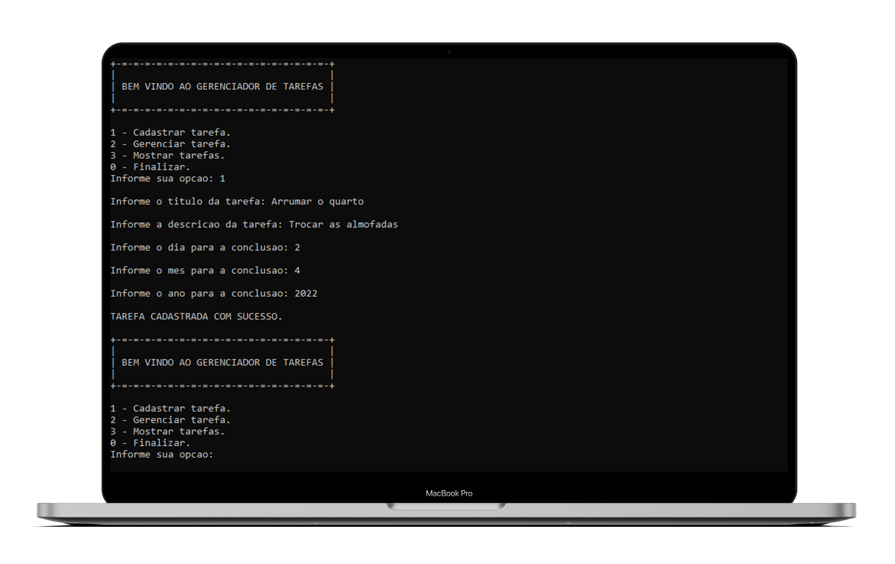
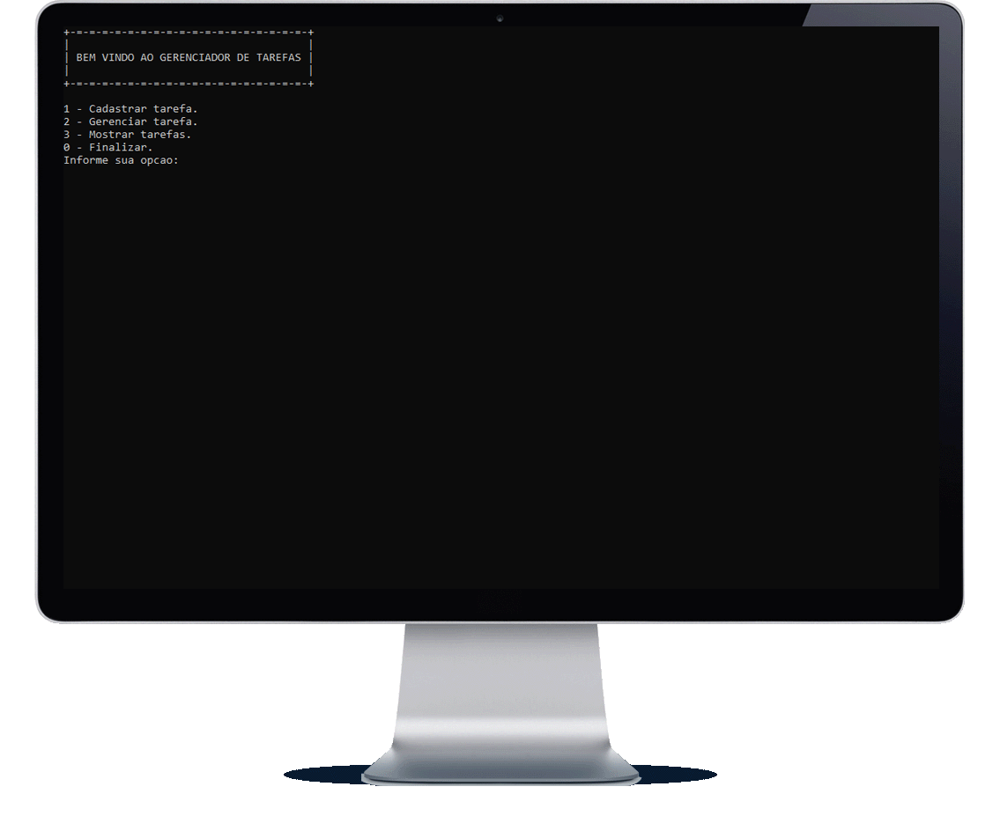
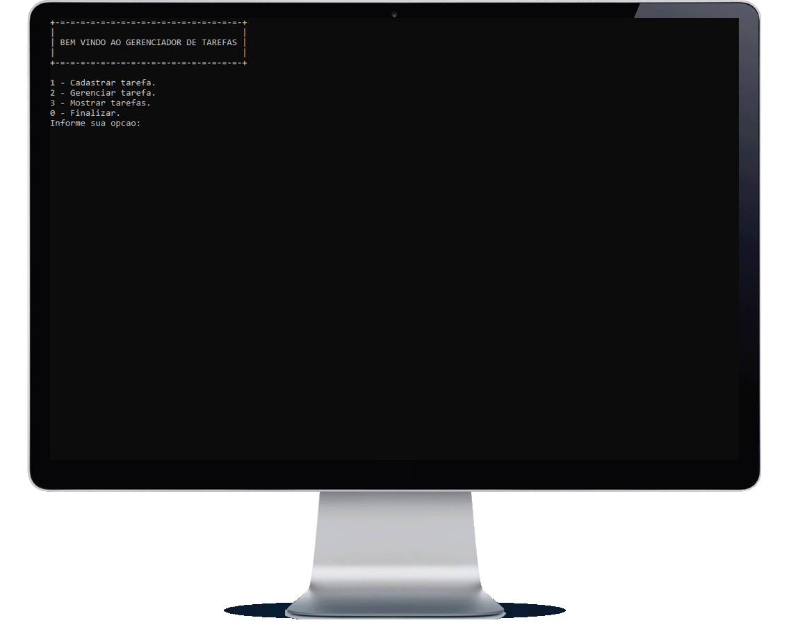

<h1 align="center">Gerenciamento de tarefas</h1>

    <a title="Sobre" href="#-sobre">Sobre</a>&nbsp;&nbsp;•&nbsp;&nbsp;  
    <a title="Funcionalidades" href="#%EF%B8%8F-funcionalidades">Funcionalidades</a>&nbsp;&nbsp;•&nbsp;&nbsp;
    <a title="Tecnologias" href="#-tecnologias-utilizadas">Tecnologias</a>&nbsp;&nbsp;•&nbsp;&nbsp;
    <a title="Funcionamento" href="#-funcionamento">Funcionamento</a>&nbsp;&nbsp;•&nbsp;&nbsp;
    <a title="path" href="#-acesso-ao-projeto">path</a>&nbsp;&nbsp;•&nbsp;&nbsp;
    <a title="Autor" href="#-desenvolvedor">Autor</a>

    &nbsp;
    &nbsp;
    

 

    

### ✔️ Status: Concluído

## 🔎 Sobre

Este programa é resultado de um trabalho da minha faculdade para a conclusão da disciplina de Algoritmos Estruturados, e o seu objetivo é gerir, de forma básica, as nossas tarefas do dia a dia.

### Uma tarefa deve ter:
 
* Identificador
* Título
* Descrição
* Status da tarefa
* Data de criação
* Data de conclusão

## ⚒️ Funcionalidades

* Registrar uma tarefa.
* Mostrar tarefas.
* Setar tarefa como concluída (Se a tarefa já estiver setada como concluída, o sistema deverá permitir apenas deletar esta tarefa).
* Excluir tarefa.
* Editar título.
* Editar a descrição.
* Editar a data de conclusão.
* Ao iniciar, o sistema deve ler um arquivo de persistência a fim de alocar na memória as tarefas preexistentes.
* Ao sair, o sistema deve guardar no mesmo arquivo de texto os dados gerados e/ou modificados durante a execução do programa.

## 🚀 Tecnologias utilizadas
<table>
    <tr>
        <td>C</td>
    </tr>
</table>

## 📷 Funcionamento

### 
CADASTRO DE TAREFAS

    

### 
TAREFAS CADASTRADAS

    

### 
TELA DE GERENCIAMENTO DE TAREFAS

    

## 📂 Acesso ao projeto 

Acesse a pasta do projeto clicando <a href="https://github.com/mmmello/Managed-Task-System/tree/main/src">aqui</a>.

## 💻 Desenvolvedor
Matheus Mello, 2022
 
 

<i><h4 align="center">"Investir em conhecimento sempre renderá os melhores juros" 💭</h4></i>